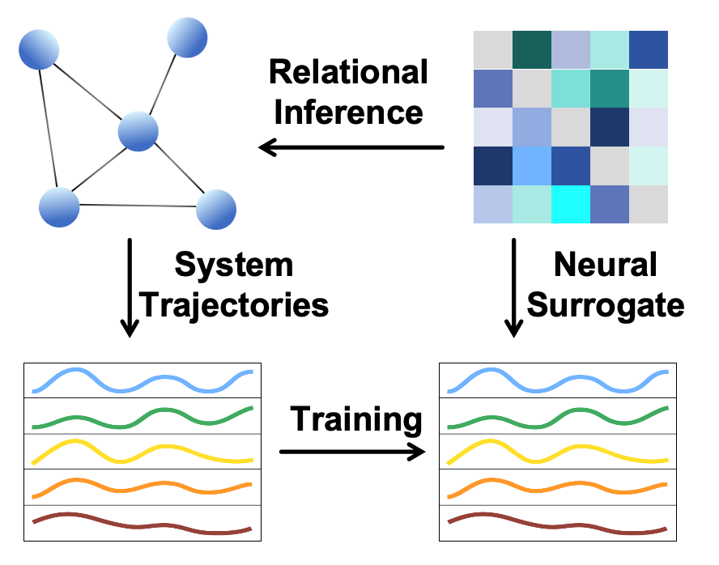

# 🕸️ DARI: Dual-Attention for Relational Inference

[](https://www.python.org/)
[](https://pytorch.org/)
<!-- [](./LICENSE) -->

> **Official implementation for the paper: "Decoupling Forward and Feedback Flows: A Dual-Attention Framework for Relational Inference"**

**DARI** is a neural relational inference framework designed to recover latent interaction graphs from observed system trajectories. By training a neural surrogate to reconstruct underlying dynamics, the model discovers the hidden topology that best explains the physical evolution of a system.

<p align="center">
  
</p>

## 🌟 Highlights

- **🔄 Dual-Attention Architecture**: Mitigates systemic biases inherent in unidirectional aggregation by modeling reciprocal coupling, leading to more robust relational inference.
- **⚡ High Efficiency**: Significantly reduces memory footprint and computational cost by replacing expensive edge-wise operations with learnable attention mechanisms.
- **🧩 Unified Framework**: Seamlessly generalizes across diverse graph topologies, naturally handling **directed, undirected, weighted, and unweighted** graphs.
- **🔬 Extensive Validation**: Rigorously tested on **7 diverse dynamical systems** (Kuramoto, Springs, SIS, FJ, MM, Diffusion, CMN), demonstrating robustness across linear, nonlinear, chaotic, and stochastic regimes.
- **🌍 Real-World Validation**: Validated on US COVID-19 data, where inferred transmission networks align closely with real-world population mobility patterns.

## 🛠️ Installation

1. Clone the repository and enter the project directory: 
   ```bash
   cd DARI
   ```

2. Install dependencies:
   Install the following packages manually:
   - numpy
   - pandas
   - torch
   - geopandas
   - matplotlib
   - networkx
   - scipy
   - requests

3. Ensure Python 3.7+ is installed.

## 🚀 Data Generation and Training

The project supports two main data types: simulated data and real COVID-19 data.

### 1. 🧬 Simulated Data

#### Data Generation
Use the scripts in the `data/` directory to generate various types of simulated data. Examples include:

- Kuramoto oscillators: `python data/generate_kuramoto.py` or `python data/generate_kuramoto_weight.py`
- SIS epidemic model: `python data/generate_SIS.py` or `python data/generate_metapop_SIS.py`
- Spring-mass systems: `python data/generate_spring.py` or `python data/generate_spring_weight.py`
- And others (FJ, MM, etc.)

Each script generates adjacency matrices and time-series trajectories for training.

#### Training
- For unweighted graphs: Run `python train.py`
- For weighted graphs: Run `python train_weight.py`

These scripts train models to infer graph structures from the generated time-series data.

### 2. 🦠 COVID-19 Data

#### Data Generation
Use scripts in the `data/covid19/` directory to process real COVID-19 mobility data:

- Run `python data/covid19/data_hand.ipynb` (Jupyter notebook) to handle and preprocess COVID-19 network data.

The processed data includes mobility graphs (OD matrices) for states like Alaska, Illinois, Maine, Minnesota, Utah, and Washington.

#### Training
Run `python train_covid19_v1.py` to train the model on the COVID-19 dataset.

This trains a model to infer mobility networks from epidemic spread data.

## 🏗️ Model Architecture

The project uses transformer-based architectures for graph inference, implemented in PyTorch.

- `model/model_trans_v1.py`: Model for unweighted graphs
- `model/model_trans_weight_v1.py`: Model for weighted graphs
- `model/any_covid19_v1.py`: Specialized model for COVID data

## 📊 Results

Trained models can be evaluated and visualized using notebooks in the `notebooks/` directory, such as `plt_od.ipynb` for plotting inferred vs. ground-truth mobility graphs.

## ⚙️ Configuration

Configuration files are in the `configs/` directory (e.g., `config_covid19_v1.yaml`).

## 📄 Citation

If you use this code, please cite the appropriate paper or repository.

## 📜 License

See LICENSE file.
